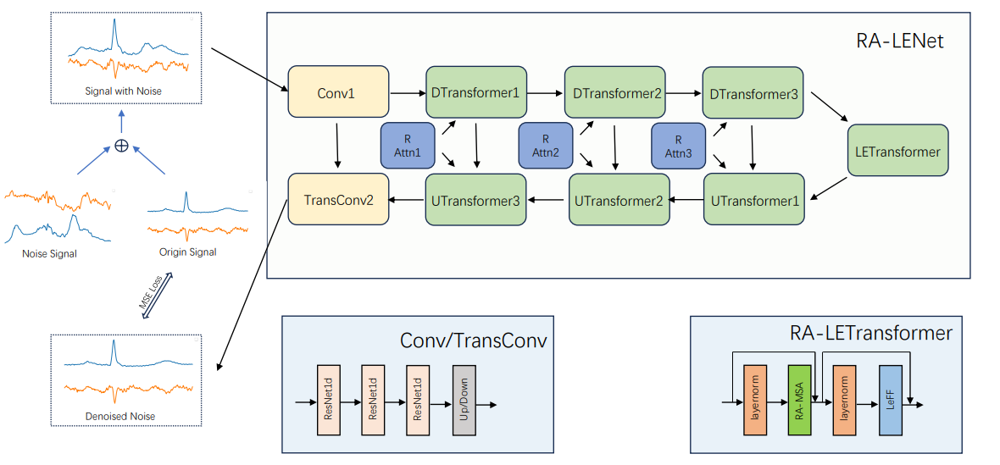

# RA-LENet:R-Wave Attention and Local Enhancement for Noise Reduction in ECG Signals

Please feel free to contact with me by Email: [2021302011121@whu.edu.cn](mailto:2021302011121@whu.edu.cn) or [caprilovel@whu.edu.cn](mailto:caprilovel@whu.edu.cn)

[Create Issues](https://github.com/caprilovel/ECG_Denoise/issues) if you have any questions.

## Abstract 

Cardiovascular disease is a major life-threatening condition commonly monitored through electrocardiogram (ECG) signals. However, the ECG signals currently generated by sensors are often accompanied by a plethora of diverse types of noise with different intensities, which causes a lot of interference in downstream tasks. In this work, we propose a deep learning based method for ECG signal denoising. Due to the different frequency characteristics of different types of noises, we use a Transformer with local enhancement as a feature extractor which can capture global dependencies. In addition, we introduce an R-wave attention mechanism to improve the most difficult R-wave reconstruction. Our experimental results demonstrate the effectiveness of our approach in denoising different types of strong noises, outperforming the state-of-the-art (SOTA) methods.

## Model Architecture

## Introduction

An implement of the RA-LENet.

You may need to download the data from these websites.

- [MIT-BIH Arrhythmia Database](https://www.physionet.org/content/mitdb/1.0.0/)
- [MIT-BIH Noise Stress Test Database](https://www.physionet.org/content/nstdb/1.0.0/)
- [Lobachevsky University Electrocardiography Database](https://physionet.org/content/ludb/1.0.1/)

## Installation

The python package you may need to be download and installed.

- [global_utils](https://github.com/caprilovel/global_utils)

The other packages you can installed with pip:

- einops
- matplotlib
- numpy
- pandas
- scikit_learn
- scipy
- sktime
- torch
- tqdm
- wfdb
## Todo
- Restructure the code.
- Package the code and environment into a docker image.

